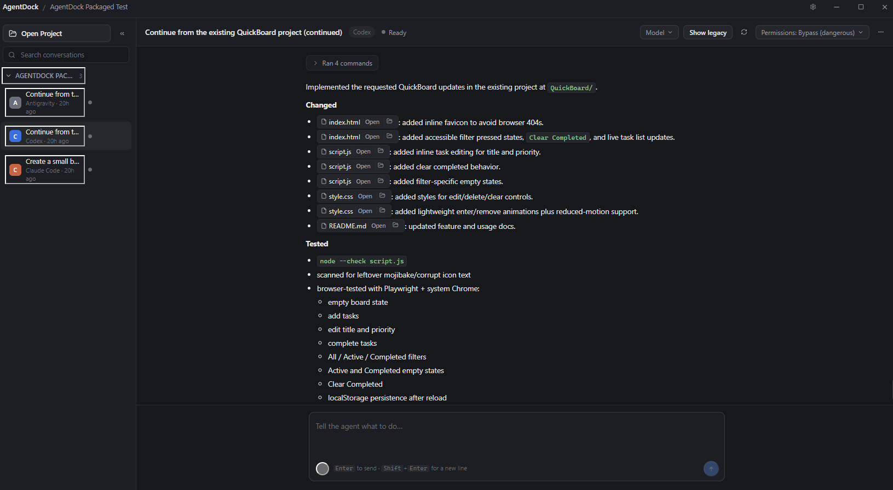

# AgentDock

A desktop app that gives you one unified chat interface for the local AI coding-agent CLIs you already have installed — Claude Code, OpenAI Codex, and Google Antigravity.

## Overview

AgentDock does **not** provide AI model access, accounts, or subscriptions of its own. It's a native desktop shell (Electron + React) that sits on top of coding-agent CLIs you install and authenticate yourself. Point it at a project folder, pick an agent, and get a proper chat UI — rich Markdown rendering, syntax-highlighted diffs, image attachments, and structured tool/approval activity — instead of a raw terminal.

Everything runs locally: AgentDock spawns the CLI processes on your machine, stores session history in a local SQLite database, and does not transmit your code, prompts, or credentials anywhere. Usage limits, billing, and authentication are entirely between you and each agent's own provider.

## Preview



## Features

- **Unified chat UI** for Claude Code, Codex, and Antigravity, with a consistent conversation view regardless of which CLI is behind it.
- **Multi-project workspace management** — add multiple project folders, each with its own sessions.
- **Multiple sessions per project**, with sidebar switching and auto-generated titles.
- **Rich Markdown rendering** of agent responses (GFM, syntax-highlighted code blocks, tables, sanitized HTML).
- **Structured activity view** — tool calls, file edits, and approval requests are shown as readable cards instead of raw log output.
- **Approval dialog** for agent permission requests, with per-agent permission modes (e.g. Claude's `acceptEdits`/`plan`/`bypassPermissions`, Codex's sandbox modes, Antigravity's `--mode` flags).
- **Live model switching** per agent where the underlying CLI/SDK supports it.
- **Git changes drawer** — view changed files, diffs, and revert individual files for the active workspace.
- **Raw terminal drawer** for viewing the underlying PTY/CLI output directly, including a trace log for debugging.
- **Handoff between agents** — build a mechanical summary of a session's requests, files touched, and open issues, then continue the conversation in a *different* agent.
- **Image attachments** for agents that support them (Codex and Antigravity response images/attachments).
- **Per-agent settings**: custom executable path override with a live "Test" action, permission mode, model, and reasoning effort.
- **Automatic CLI detection** with diagnostics (resolved path, version, executable type) shown in Settings.
- **System/light/dark appearance** with a native-feeling custom titlebar.

## Supported coding agents

| Agent | CLI package | Notes |
|---|---|---|
| Claude Code | `claude` | Backed by `@anthropic-ai/claude-agent-sdk`; live model and permission-mode switching. |
| OpenAI Codex CLI | `codex` | Backed by `@openai/codex-sdk`; live model catalogue fetched from the CLI's app-server. |
| Google Antigravity | `agy` (also probes `antigravity`, `google-antigravity`) | Terminal/PTY-based integration with output classification; no structured JSON transport. |

AgentDock detects each CLI on your `PATH` (plus a few known install locations) at runtime. You must install and authenticate each CLI yourself — see each provider's own documentation.

## Platform support

| Platform | Status | Details |
|---|---|---|
| Windows (x64) | **Confirmed** | NSIS installer and portable build; packaged-app smoke test in `scripts/e2e-packaged-smoke-test.cjs`. Executable resolution handles PATH, PATHEXT, and known install directories. |
| macOS (Intel, x64) | **Confirmed** | DMG and zip build; packaged-app smoke test in `scripts/e2e-packaged-smoke-test-mac.cjs`. Builds are unsigned — see [Troubleshooting](#troubleshooting). |
| macOS (Apple Silicon, arm64) | **Configured, not independently verified** | DMG and zip build via `npm run package:mac:arm64`; the packaged-app smoke test targets the x64 build only, so the arm64 output hasn't gone through the same automated check. Builds are unsigned. |
| Linux | **Experimental** | An AppImage target is configured in `electron-builder.yml`, but there is no dedicated Linux smoke test and no known-install-directory fallback for CLI detection (PATH search only). Use at your own risk. |

## Prerequisites

- **Node.js** (v20+ recommended; no exact version is pinned in `package.json`)
- **npm** (ships with Node.js)
- **Git** (used for the Changes drawer's diff/revert features)
- At least one of the supported agent CLIs, installed and authenticated per its own provider's instructions:
  - Claude Code (`claude`)
  - OpenAI Codex CLI (`codex`)
  - Google Antigravity (`agy`)

## Installation

### Option A: Download a packaged release (recommended)

Prebuilt builds are published on the [GitHub Releases page](https://github.com/crossainthero-lab/AgentDock/releases) — no need to install Node.js, clone the repo, or build anything yourself. Current releases are early, unsigned previews:

- **Windows (x64)**: installer (`AgentDock Setup *.exe`) or a portable `.exe` — both under the Windows release.
- **macOS (Intel and Apple Silicon)**: `.dmg` or `.zip` — under the macOS release.

Builds are unsigned, so Windows SmartScreen and macOS Gatekeeper will warn on first launch — see [Troubleshooting](#troubleshooting) for how to get past that.

### Option B: Build from source

Useful if you're on Linux, want the latest unreleased changes, or are developing on AgentDock itself. Once built, the packaging commands below produce the same kind of output under `release/`.

```bash
git clone https://github.com/crossainthero-lab/AgentDock.git
cd AgentDock
npm install
npm run dev
```

`npm install` runs a `postinstall` step (`scripts/fix-native-permissions.js`) that fixes execute permissions on `node-pty`'s native binaries — required for the terminal/PTY integration to work after a fresh install.

## Development commands

These are copied directly from `package.json`:

| Command | Description |
|---|---|
| `npm run dev` | Start the app in development mode (`electron-vite dev`). |
| `npm run build` | Build the app for production (`electron-vite build`). |
| `npm run typecheck` | Type-check both the main and web (renderer) TypeScript projects. |
| `npm run typecheck:node` | Type-check the main/preload process only. |
| `npm run typecheck:web` | Type-check the renderer process only. |
| `npm test` | Run the unit/component test suite (Vitest). |
| `npm run rebuild:native` | Rebuild `node-pty` against the current Electron ABI. |
| `npm run native:check` | Verify `node-pty`'s native binary loads correctly under Electron. |
| `npm run test:pty` | Standalone PTY smoke test, run under Electron's Node runtime. |
| `npm run test:e2e:antigravity` | Manual, local-only E2E smoke test against a real built app and a real `agy` process (requires Antigravity installed/authenticated). |
| `npm run package` | Build and package an unpacked app directory (`electron-builder --dir`). |
| `npm run package:win` | Build and package a Windows x64 installer/portable app. |
| `npm run package:mac` | Build and package a macOS x64 app. |
| `npm run package:mac:arm64` | Build and package a macOS Apple Silicon (arm64) app. |

There is no dedicated `package:linux` script; run `electron-builder --linux` directly after `npm run build` (see [Build and packaging](#build-and-packaging)).

## Build and packaging

AgentDock is packaged with [electron-builder](https://www.electron.build/), configured in [`electron-builder.yml`](electron-builder.yml).

### Windows

```bash
npm run package:win
```

Produces an NSIS installer (per-user, no admin elevation required) and a portable executable in `release/`. Builds are unsigned, so Windows SmartScreen will show a warning on first run.

### macOS

```bash
npm run package:mac        # Intel (x64)
npm run package:mac:arm64  # Apple Silicon (arm64)
```

Both commands run `scripts/fix-native-permissions.js` before building to ensure `node-pty`'s native binaries retain their execute bit. Produces a `.dmg` and `.zip` in `release/`. Builds are unsigned (no Apple Developer certificate/notarization), so Gatekeeper will flag the app as coming from an unidentified developer on first launch.

### Linux

Linux packaging is configured (`AppImage` target) but has no dedicated `npm run package:linux` script and is not covered by an automated smoke test:

```bash
npm run build
npx electron-builder --linux
```

## How it works

AgentDock's Electron **main process** owns everything CLI-related: it detects installed agent CLIs on your system, spawns them as child processes (either via each provider's SDK — `@anthropic-ai/claude-agent-sdk`, `@openai/codex-sdk` — or via a PTY session for Antigravity, using `node-pty`), and maps each agent's own event/output format into a shared internal event model. The **renderer** (React) subscribes to that event stream over Electron IPC and renders it as a conversation, without needing to know which agent produced it.

Session, workspace, and message data is stored locally in a SQLite database (via `sql.js`) inside Electron's per-user application data directory — there is no remote backend or account system.

Git-related features (the Changes drawer) shell out to the `git` executable configured in Settings (defaults to `git` on `PATH`).

## Architecture / project structure

```
src/
├── main/                  # Electron main process
│   ├── agents/             # Per-agent adapters, event mappers, and the adapter registry
│   │   ├── claude/          # Claude Code (Claude Agent SDK transport)
│   │   ├── codex/           # Codex (Codex SDK transport)
│   │   └── antigravity/     # Antigravity (PTY + output classifier)
│   ├── db/                  # SQLite schema, migrations, and repositories
│   ├── ipc/                 # IPC channel handlers (one file per feature area)
│   ├── services/             # Detection, PTY, git, handoff, settings, workspace, etc.
│   └── terminal/             # Terminal screen buffer and interaction detection
├── preload/                # Context-isolated IPC bridge exposed to the renderer
├── renderer/                # React UI (chat, sidebar, settings, drawers)
│   ├── components/
│   ├── state/                # App-wide state (AppStateContext, conversation store)
│   └── lib/
└── shared/                  # Types, IPC channel names, and agent-event contracts
    shared across main/preload/renderer

scripts/    # Native-module fixups, detection/PTY smoke tests, packaged-app E2E tests
tests/      # Vitest unit/component tests (main, renderer, shared)
build/      # Packaging source assets (icons) — committed, not build output
```

## Security and privacy

- AgentDock runs local CLI processes on your machine (via SDKs or a PTY session) — it does not proxy or intercept your requests to any AI provider.
- You are responsible for installing and authenticating each agent CLI (Claude Code, Codex, Antigravity) yourself; AgentDock stores per-agent settings such as a custom executable path but does not manage credentials for any of them.
- Conversation and session data is stored locally in a SQLite database under Electron's per-user application data directory. AgentDock does not make outbound network requests of its own and does not collect or transmit telemetry.
- **Never commit secrets or API keys** to this repository. `.gitignore` already excludes `.env*` files and local SQLite databases.
- Packaged builds are currently **unsigned** on both Windows and macOS (see [Build and packaging](#build-and-packaging)) — only run builds you trust the source of.

## Known limitations

- Packaged builds are unsigned on Windows and macOS; there is no code-signing or notarization configured.
- Linux support is experimental: no known-install-directory fallback for CLI detection, no dedicated packaging script, and no automated packaged-app smoke test.
- Antigravity integration is PTY/terminal-based rather than a structured SDK transport, and does not support live in-process permission-mode switching (`supportsLivePermissionSwitch: false`); model switching works by restarting the underlying process and resuming the conversation.
- Codex does not support live in-process permission-mode switching either; permission/sandbox mode is applied at thread creation.
- Agent-specific slash commands (e.g. Claude's `/clear`, `/compact`) are not exposed through AgentDock — each agent's `commands` capability list is currently empty.
- No automatic release/update mechanism is included; you build and package the app yourself.

## Troubleshooting

**CLI not detected in Settings**
AgentDock searches your `PATH` plus a few known install locations for each CLI's executable. If detection fails, check the diagnostics shown in Settings → Agents (they list every path/extension combination checked), confirm the CLI runs from a regular terminal (`claude --version`, `codex --version`, `agy --version`), and consider setting a custom executable path override.

**"Missing execute permission" / PTY spawn failures on macOS or Linux**
`node-pty`'s native `spawn-helper` binary can lose its execute bit during install. Run:
```bash
node scripts/fix-native-permissions.js
```
This also runs automatically on `npm install` (`postinstall`) and before every `npm run package:mac*` build.

**`node-pty` fails to load / native module ABI mismatch**
Rebuild the native module against your installed Electron version:
```bash
npm run rebuild:native
npm run native:check
```

**macOS: "AgentDock can't be opened because it is from an unidentified developer"**
The build is unsigned. Right-click the app and choose **Open**, or allow it via **System Settings → Privacy & Security → Open Anyway**.

**Windows: SmartScreen warning on first run**
Expected for an unsigned build — choose **More info → Run anyway**.

**Windows packaging fails while fetching `winCodeSign`**
`electron-builder.yml` already disables `signAndEditExecutable` to avoid this (it requires extracting an archive containing symlinks that non-elevated Windows accounts can't create). If you still hit this, ensure you're on an up-to-date `electron-builder` version.

## Contributing

1. Fork the repository and create a feature branch.
2. Run `npm install`, then `npm run typecheck` and `npm test` before opening a pull request.
3. Keep changes focused; include a clear description of what changed and why.
4. Do not commit secrets, API keys, or personal file paths.

## License

No license file is currently included in this repository. Until one is added, all rights are reserved by the copyright holder — please contact the maintainers before reusing or redistributing this code.

## Disclaimer

AgentDock is an independent, unofficial project. It is not affiliated with, endorsed by, or sponsored by Anthropic, OpenAI, or Google. "Claude Code," "Codex," and "Antigravity" are the products of their respective owners; AgentDock simply provides a local interface to CLIs you install and authenticate separately.
